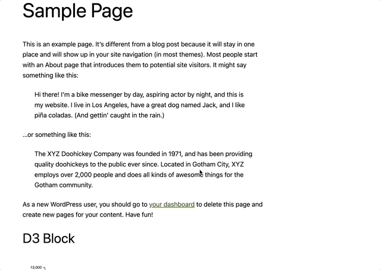

# WP Visualization Blocks <!-- Title -->

<!-- Description -->
This is a demo WordPress plugin that adds a block to the Gutenberg editor that allows you to add a visualization to your post or page. The visualization is created using the [D3.js](https://d3js.org/) and [Plotly](https://plotly.com/javascript/react/)library.

## Installation <!-- Subtitle -->

### Prerequisites <!-- description of prerequisites -->
- WordPress 6.0 or higher
- PHP 7.0 or higher
- Node.js 10.0 or higher (for development)
- Composer (for development)

<!-- description setup instructions with composer and npm instructions -->
1. Clone this repository into your WordPress plugins directory
2. Run `npm install` to install the dependencies
3. Run `npm run build` to build the plugin
4. Activate the plugin in the WordPress admin

## Usage <!-- Subtitle -->

